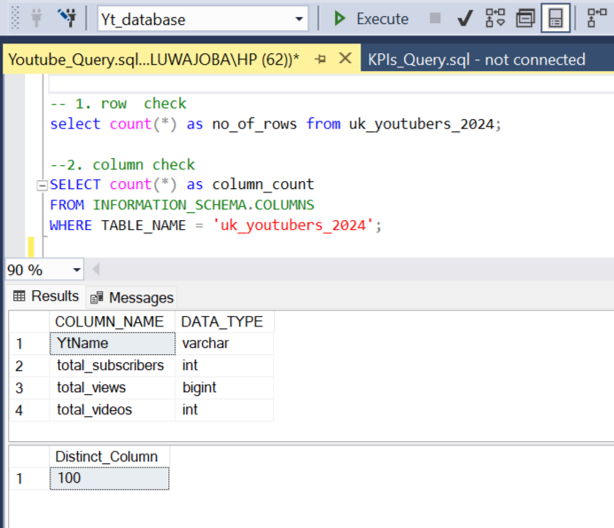
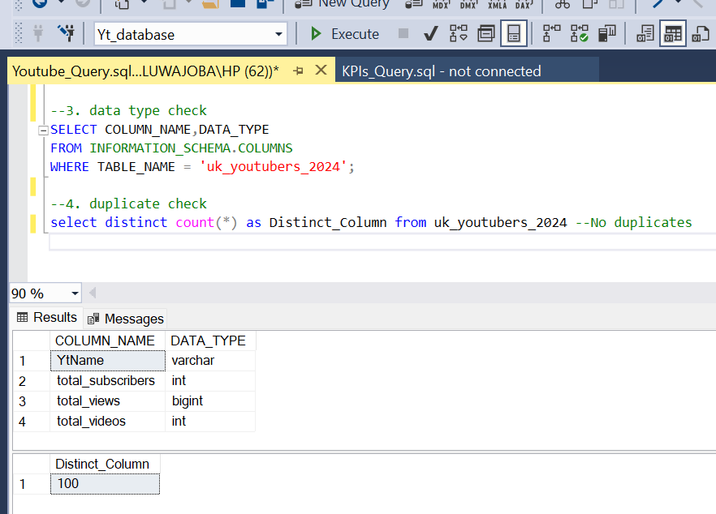
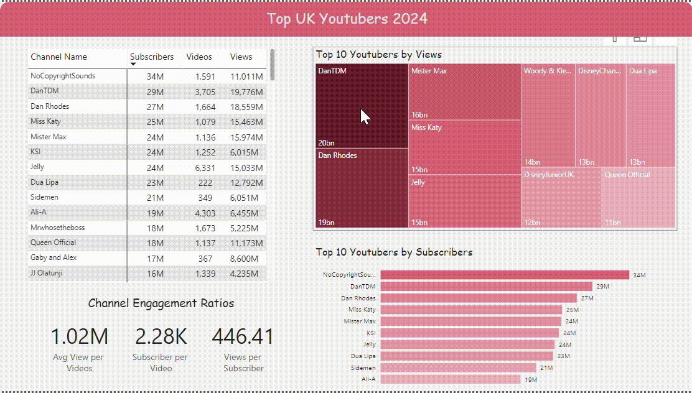

# Data Portfolio: Excel to Power BI

## Table of Contents
- [Objectives](#objectives)
- [Data Source](#data-source)
- [Stages](#stages)
- [Design](#design)
  - [Dashboard components requirement](#Dashboard components requirement)
  - [Tools](#tools)
- [Development](#development)
  - [Pseudocode](#pseudocode)
  - [Data Exploration](#DataExploration)
  - [Data Cleaning](#DataCleaning)
  - [Transform the Data](#TransformtheData)
  - [Create the SQL View](#CreatetheSQLView)
- [Data Quality Test](#testing)
- [Visualization](#visualization)
- [Analysis](#Analysis)
- [Validation](#Validation)  

## Objectives
The Head of Marketing wants to find out who the top YouTubers are in 2024 to determine which YouTubers are most suitable for marketing campaigns for the remainder of the year.

### Ideal Solution
To create a dashboard that provides insights into the top UK YouTubers in 2024 that includes the following:
- Subscriber count
- Total views
- Total videos
- Engagement metrics

This will help the marketing team make informed decisions regarding which YouTubers to collaborate with for their marketing campaigns.

## Data Source
### What data is needed to achieve our objective?
We need data on the top UK YouTubers in 2024 that includes:
- Channel names
- Total subscribers
- Total views
- Total videos uploaded

### Where is the data coming from?
The data is sourced from Kaggle (an Excel extract), which can be found [here](https://www.kaggle.com/datasets/bhavyadhingra00020/top-100-social-media-influencers-2024-countrywise?resource=download).

## Stages
- Design
- Development
- Testing
- Analysis

## Design
### Dashboard components requirement
To understand what it should contain, we need to figure out what questions we need the dashboard to answer:
1. Who are the top 10 YouTubers with the most subscribers?
2. Which 3 channels have uploaded the most videos?
3. Which 3 channels have the most views?
4. Which 3 channels have the highest average views per video?
5. Which 3 channels have the highest views per subscriber ratio?
6. Which 3 channels have the highest subscriber engagement rate per video uploaded?

### Tools

| Tool | Purpose
 --- | ---
| Excel | Exploring Data |
|  SQL Server | Cleaning, testing, and analyzing the data |
| Power BI | Visualizing the data via interactive dashboards |
| GitHub | Hosting the project documentation and version control |

## Development

### Pseudocode
- What is the general approach in creating this solution from start to finish?
1. Get the data
2. Explore the data in Excel
3. Load the data into SQL Server
4. Clean the data with SQL
5. Visualize the data in Power BI
6. Generate the findings based on the insights
7. Write the documentation + commentary
8. Publish the data to GitHub Pages

### Data Exploration Notes
1. There are at least 4 columns that contain the data we need for this analysis, which signals we have everything we need from the file without needing to contact the client for any more data.
2. The first column contains the channel ID with what appears to be channel IDS, which are separated by a @ symbol - we need to extract the channel names from this.
3. Some of the cells and header names are in a different language - we need to confirm if these columns are needed, and if so, we need to address them.
4. We have more data than we need, so some of these columns would need to be remove

### Data Cleaning
The cleaned data should meet the following criteria and constraints:
  - Only relevant columns should be retained.
  - All data types should be appropriate for the contents of each column.
  - No column should contain null values, indicating complete data for all records.
Below is a table outlining the constraints on our cleaned dataset:

| Property | Description |
 --- | ---
| Number of Rows | 100 | 
| Number of Columns | 4 |

And here is a tabular representation of the expected schema for the clean data:

| Column Name	| Data Type	| Nullable |
---|---|---
| channel_name | VARCHAR | NO |
| total_subscribers	| INTEGER	| NO |
| total_views	| INTEGER	| NO |
| total_videos |	INTEGER |	NO |

- What steps are needed to clean and shape the data into the desired format?
1. Remove unnecessary columns by only selecting the ones you need
2. Extract Youtube channel names from the first column
3. Rename columns using aliases

## Transform the Data
The following SQL query is used to transform the data to extract YouTuber names (before the '@' character) along with their total subscribers, views, and videos uploaded:

```sql 
SELECT 
	cast(SUBSTRING(NOMBRE, 1, CHARINDEX('@', NOMBRE) - 1) as varchar(100)) AS YtName
	,[total_subscribers]
    ,[total_views]
     ,[total_videos]
   FROM Top_UK_YTubers;

```
## Create the SQL View
``` sql
create view uk_youtubers_2024 as
SELECT 
	cast(SUBSTRING(NOMBRE, 1, CHARINDEX('@', NOMBRE) - 1) as varchar(100)) AS YtName
	,[total_subscribers]
    ,[total_views]
     ,[total_videos]
   FROM [Yt_database].[dbo].[Top_UK_YTubers];

```

## Data Quality Test
Here are the data quality tests conducted:

### Row and Column Check


### Data Types and Duplicate Check




##  Visualization
### Results
- What does the visualization look like?

    
  

## Analysis
- What did we find out?
  Here are the key questions we need to answer for our marketing client:
1. Who are the top 10 YouTubers with the most subscribers?
2. Which 3 channels have uploaded the most videos?
3. Which 3 channels have the most views?
4. Which 3 channels have the highest average views per video?
5. Which 3 channels have the highest views per subscriber ratio?
6. Which 3 channels have the highest subscriber engagement rate per video uploaded?

### 1. Who are the top 10 YouTubers with the most subscribers?

| Rank	| Channel Name	| Subscribers (M) |
--- | --- | --- 
| 1 | NoCopyrightSounds | 33.60 |
| 2 | DanTDM | 28.60 |
| 3 | Dan Rhodes | 26.50|
| 4 | Miss Katy | 33.60 |
| 5 | Mister Max| 24.50 |
| 6 | KSI | 24.10 |
| 7 | Jelly| 23.50 |
| 8 | Dua Lipa | 23.30 |
| 9 | Sidemen | 21.00 |
| 10 | Ali-A | 18.90 |

### 2. Which 3 channels have uploaded the most videos (excluding news channels)?

| Rank	| Channel Name	| Vidoes |
--- | --- | --- 
| 1 | GRM Daily	| 14,696 |
| 2 | Manchester City | 8,248|
| 3 | Yogscast	 | 6,435 |

### 3. Which 3 channels have the most views?

| Rank	| Channel Name	|Views (M) |
--- | --- | --- 
| 1 | DanTDM | 19,776 |
| 2 | Dan Rhodes | 18,559|
| 3 | Mister Max| 15,974 |

### 4. Which 3 channels have the highest average views per video?

| Rank | Channel Name | Averge Views per Video (M) |
--- | --- | --- 
| 1 | Mark Ronson | 32.27 |
| 2 | Jessie J | 5.97 |
| 3 | Dua Lipa	| 5.76 |

### 5. Which 3 channels have the highest views per subscriber ratio?

| Rank | Channel Name | Views per Subscriber (M) |
--- | --- | --- 
| 1 | GRM Daily | 1,186 |
| 2 | Nicolodeon UK | 1,061 |
| 3 | Disney Junior UK	| 1,032 |

### 6. Which 3 channels have the highest subscriber engagement rate per video uploaded?

| Rank | Channel Name    | Subscriber Engagement Rate  |
|------|-----------------|---------------------------- |
| 1    | Mark Ronson     | 343,000                     |
| 2    | Jessie J        | 110,416.67                  |
| 3    | Dua Lipa        | 104,954.95                  |

### Notes
For this analysis, we’ll prioritize analysing the metrics that are important in generating the expected ROI for our marketing client, which are the YouTube channels wuth the most

- subscribers
- total views
- videos uploaded

## Validation
### 1. Youtubers with the most subscribers 

#### Calculation breakdown:
1. NoCopyrightSounds 
- Average views per video = 6.92 million
- Product cost = $5
- Potential units sold per video = 6.92 million x 2% conversion rate = 138,400 units sold
- Potential revenue per video = 138,400 x $5 = $692,000
- Campaign cost (one-time fee) = $50,000
- **Net profit = $692,000 - $50,000 = $642,000**

b. DanTDM

- Average views per video = 5.34 million
- Product cost = $5
- Potential units sold per video = 5.34 million x 2% conversion rate = 106,800 units sold
- Potential revenue per video = 106,800 x $5 = $534,000
- Campaign cost (one-time fee) = $50,000
- **Net profit = $534,000 - $50,000 = $484,000**

c. Dan Rhodes

- Average views per video = 11.15 million
- Product cost = $5
- Potential units sold per video = 11.15 million x 2% conversion rate = 223,000 units sold
- Potential revenue per video = 223,000 x $5 = $1,115,000
- Campaign cost (one-time fee) = $50,000
- **Net profit = $1,115,000 - $50,000 = $1,065,000**


Best option from category: Dan Rhodes
  


